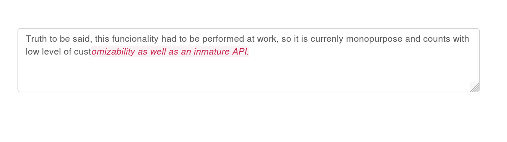

# Jiris

Have you ever noticed that some apps set a different style to text excess in a form-like element? E.g: like Twitter, when the well-known 140 are exceeded, the background of the over-140 text is red. This inmature plugin intends to provide that functionality.

## Screenshot



## Quick start

Libraries required: 
  - jQuery ~> 1.9.\* 

Code

```css

.ok {

}

.excess {
    background-color: #f9f2f4;
    color: #c7254e;
}
```

```javascript
    var config = {
        'segments': [
            {'len': 140, 'className': 'ok', 'tag': 'span'},
            {'len': 200, 'className': 'excess', 'tag': 'em'}
        ]
    };

    $('#sample').jiris(config);
```

## Aditional/Default configuration

```javascript
$.fn.jiris.debugMode = false;
$.fn.jiris.defaultEditableClass = "editable-area";
$.fn.jiris.namespace = "jiris";
$.fn.jiris.defaults = {
    'maxlength': 0,
    'min-width': '100%',
    'min-height': "100px",
    'height': "auto",
    'resize': "both",
    'segments': [
        {'len': 11,  'className': $.fn.jiris.namespace + ' jiris-default-1', 'tag': 'span'},
        {'len': 13,  'className': $.fn.jiris.namespace + ' jiris-default-2', 'tag': 'span'},
        {'len': 17,  'className': $.fn.jiris.namespace + ' jiris-default-3', 'tag': 'span'}
    ]
};
```

## TODO

  - Implement **onSegmentChanged** method. Event fired whenever the number of styled elements changes.
  - Evolve *len* property to something like `{'from': 20, 'len': 7}` to allow styling based in ranges.
 
### Contributing

... Have you got here? Be my guest.

